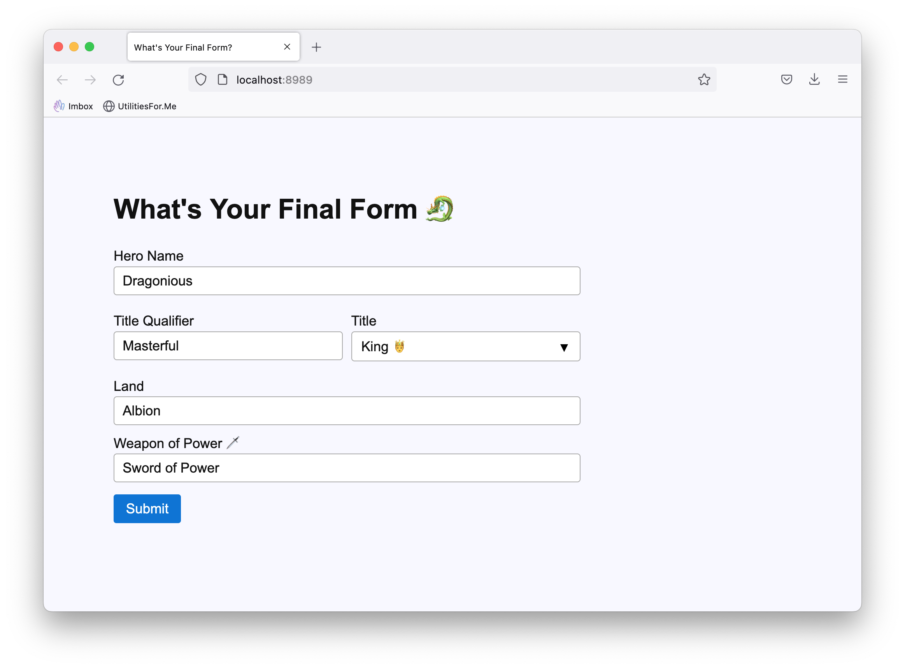

# Learn Final Form



## What is this?

This is project whose intent is to make the learning of final form as simple as possible. There are a varity of issues in the way Final Forms docs and instructional materials are laid out, but this project is an attempt to soften some of those sharp edges to make working with library more fun!

## What is Final Form?

__[Final Form](https://final-form.org/) for folks who don't know is a form library written in Javascript that helps you cleanly maintain forms with a lot of potential _interacitivty_, _logic_, and _state_.__ It has the added benefit of being framework agnostic so folks who use React or Vue or "INSERT JS FRAMEWORK HERE" can adopt the patterns laid out in the core or vanilla Final Form.

## How do I run the final demo?

- Clone this repo 🌱
    - `git clone <this-repo> && cd <this-repo>`
- Install its dependencies (Final Form and Webpack)
    - `npm i`
- Run the server
    - `npm run serve`
- Visit localhost at the port specified in the webpack config under dev server
    - `curl http://localhost:8989`

## How is the project laid out?

The project has two primary assets, the _index.html_ document located at _dist/index.html_ and the _index.js_ script (located at _src/index.js_) which, when transpiled by Webpack via Babel becomes _dist/main.js_. 

- The _index.html_ is an aggressively simple HTML form. It contains nothing but simple fields.

- The _index.js_ file attempts to demonstrate all of the __essential__ pieces of the final form library including. 

- The creation of a form object:
```js
const form = createForm({ initialValues, onSubmit, validate })
```

- Creating a subscription to a created form:
```js
const unsubscribe = form.subscribe(()=>{})
```

- Registering fields on your form:

```js
const unregisterField = form.registerField(inputName, (state) => {})
```

- Performing logic on submission:

```js
// See first example where we supply an onSubmit function to createForm
const onSubmit = (values) => {
    const { heroName, titleQualifier, title, land, weapon} = values
    setTimeout(() => {
        alert(`All hail ${heroName}, the ${titleQualifier.toLowerCase()} ${title} of ${land}, wielder of the ${weapon}!`)
    }, 300)
}
```

## (WIP) How do I set up the demo 

- Create a project direction
    - `mkdir learn-final-form-broh && cd learn-final-form-broh`
- Initialize it as an NPM project 
    `npm init -y`
- Install some deps (including final form and a bundler)
    - `npm i --save-dev webpack-cli`
    - `npm i --save final-form`
- Create the following
    - An entrypoint file for webpack _src/index.js_ 
    - A _dist_ directory with an _index.html_ which looks for a _main.js_ in the same directory
    - A compile script (`webpack`) in your _package.json_
- Write your code!
